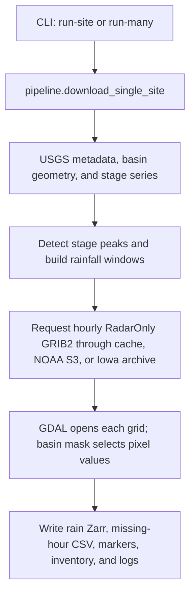
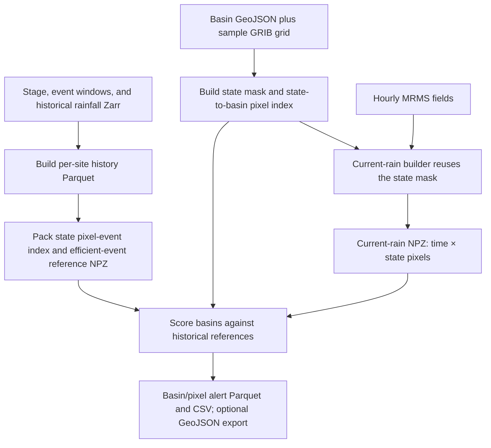

# `mrms-usgs-events-2m`: Package Architecture and Function Reference

- **Reviewed source:** [`81e6eab`](https://github.com/GonzaloAlbertoForeroBuitrago/mrms_usgs_events_2m/tree/81e6eab3334cb006c32dbd5f194ba75a6aedc084)
- **Distribution:** `mrms-usgs-events-2m`
- **Python import:** `mrms_usgs_events_2m`
- **Command:** `mrms-usgs-2m`

**Document revision:** 26 September 2026

This guide describes the package at the pinned commit above. The source audit covered **28 Python files and 155 function/method definitions**, including nested helpers. The function reference links each entry to its source line.

## Executive summary

`mrms-usgs-events-2m` is a Python package for connecting USGS stream-stage observations with MRMS rainfall sampled over selected basin pixels. Its historical workflow retrieves station and basin inputs, detects stage peaks, defines event windows, downloads MRMS GRIB2 files, extracts basin pixels, and stores the resulting time series in Zarr. Its EWS modules also prepare state-level spatial indices and historical references for current-rainfall alert scoring. The package uses resumable file-based outputs and supports parallel work for selected acquisition and processing paths. In the reviewed source, rainfall selection is hourly `RadarOnly_QPE_01H`; the desired two-minute `PrecipRate` workflow is not implemented in this revision.

## Short paper-ready description

> The `mrms-usgs-events-2m` Python package links U.S. Geological Survey stream-stage observations to Multi-Radar Multi-Sensor precipitation data for basin-scale hydrologic analysis. It retrieves station metadata, basin geometry, and stage time series; identifies stage peaks and associated rainfall windows; extracts MRMS rainfall values at basin-intersecting grid cells; and stores the selected time series in Zarr. Supporting modules construct state-level spatial indices, summarize historical rainfall–stage event relationships, and calculate current basin and pixel alerts from precomputed references. The reviewed release supports resumable file-based processing and parallel hourly acquisition. Its current rainfall workflow uses hourly `RadarOnly_QPE_01H`; two-minute `PrecipRate` processing remains a planned extension.

This paragraph describes implemented software behavior. It does not establish forecast skill or hydrologic validation. The project README lists DOI [10.5281/zenodo.19378061](https://doi.org/10.5281/zenodo.19378061); use the archived release metadata and an appropriate software citation in a paper.

## 1. Identity and implementation status

| Item | Current source |
|---|---|
| GitHub repository | [`mrms_usgs_events_2m`](https://github.com/GonzaloAlbertoForeroBuitrago/mrms_usgs_events_2m) |
| Reviewed revision | `81e6eab3334cb006c32dbd5f194ba75a6aedc084` |
| Distribution name and version | `mrms-usgs-events-2m`, `0.1.0` |
| Import package | `mrms_usgs_events_2m` |
| Console entry point | `mrms-usgs-2m` → `mrms_usgs_events_2m.cli:app` |
| Declared Python floor | Python 3.10 or newer |
| Current MRMS product configured in code | `RadarOnly_QPE_01H_00.00` |
| Desired product named for the next version | `PrecipRate` at its two-minute update cadence |
| Implemented rainfall time step | Hourly timestamps and filenames in the historical and current-rain builders |
| Main package/app connection | The Tethys app imports the state-rain builder, current-alert scorer, and GeoJSON exporter; the package itself does not implement the app's S3 upload/download service. |

**Product terminology matters:** NOAA lists both `PrecipRate` and `RadarOnly_QPE_01H` with a two-minute update cycle. `PrecipRate` is a rate in mm/hr; `RadarOnly_QPE_01H` is a one-hour accumulation in mm. Therefore “updated every two minutes” and “a two-minute accumulation” are not interchangeable. The code in this commit requests `RadarOnly_QPE_01H` and floors times to the hour. [NOAA MRMS product table](https://www.nssl.noaa.gov/projects/mrms/operational/tables.php)

## 2. Package structure and relationships

The first table shows each module's role, its callers or dependencies, and the result it produces. The following function index documents every function and method in the reviewed package.

| Python file | Responsibility | Connects to | Main result |
|---|---|---|---|
| [__init__.py](https://github.com/GonzaloAlbertoForeroBuitrago/mrms_usgs_events_2m/blob/81e6eab3334cb006c32dbd5f194ba75a6aedc084/mrms_usgs_events_2m/__init__.py) | Public package entry point. | Imports config.py, pipeline.py and paths.py. | Exports PipelineConfig, download_single_site, download_many_sites and normalize_site_id. |
| [config.py](https://github.com/GonzaloAlbertoForeroBuitrago/mrms_usgs_events_2m/blob/81e6eab3334cb006c32dbd5f194ba75a6aedc084/mrms_usgs_events_2m/config.py) | Shared defaults, HTTP configuration and output locations. | Used by pipeline.py, cli.py, mrms.py, mrms_parallel.py and ews/state_rain.py. | Resolved configuration object; no data download. |
| [paths.py](https://github.com/GonzaloAlbertoForeroBuitrago/mrms_usgs_events_2m/blob/81e6eab3334cb006c32dbd5f194ba75a6aedc084/mrms_usgs_events_2m/paths.py) | Station identifiers and deterministic file paths. | Used by pipeline.py and usgs_api.py. | Path dictionary shared by the historical pipeline. |
| [io.py](https://github.com/GonzaloAlbertoForeroBuitrago/mrms_usgs_events_2m/blob/81e6eab3334cb006c32dbd5f194ba75a6aedc084/mrms_usgs_events_2m/io.py) | Time handling and station inventory writing. | Used by usgs_api.py, events.py, pipeline.py and cli.py. | Clean time-series data and appended inventory rows. |
| [logger.py](https://github.com/GonzaloAlbertoForeroBuitrago/mrms_usgs_events_2m/blob/81e6eab3334cb006c32dbd5f194ba75a6aedc084/mrms_usgs_events_2m/logger.py) | Run and per-station logging. | Called by pipeline.py and cli.py; uses Python logging, not a data-processing service. | Rotating log files and console messages; LogPaths dataclass holds locations. |
| [exceptions.py](https://github.com/GonzaloAlbertoForeroBuitrago/mrms_usgs_events_2m/blob/81e6eab3334cb006c32dbd5f194ba75a6aedc084/mrms_usgs_events_2m/exceptions.py) | Dependency error type. | Raised by events.py, geo.py and mrms.py. | MissingOptionalDependency subclasses ImportError; no methods are defined. |
| [usgs_api.py](https://github.com/GonzaloAlbertoForeroBuitrago/mrms_usgs_events_2m/blob/81e6eab3334cb006c32dbd5f194ba75a6aedc084/mrms_usgs_events_2m/usgs_api.py) | USGS station metadata, basin geometry and water-stage acquisition. | pipeline.py and cli.py call this module; helpers use config.py, io.py and paths.py. | Monitoring-location JSON, basin JSON, Stage_ft Parquet and completion markers. |
| [events.py](https://github.com/GonzaloAlbertoForeroBuitrago/mrms_usgs_events_2m/blob/81e6eab3334cb006c32dbd5f194ba75a6aedc084/mrms_usgs_events_2m/events.py) | Selects water-stage peaks and surrounding rainfall windows. | pipeline.py calls postprocess_events_and_windows; HydroEventDetector performs event detection. | Top-event CSV, rainfall-window CSV and event completion marker. |
| [geo.py](https://github.com/GonzaloAlbertoForeroBuitrago/mrms_usgs_events_2m/blob/81e6eab3334cb006c32dbd5f194ba75a6aedc084/mrms_usgs_events_2m/geo.py) | Builds a basin selection mask from a sample MRMS grid. | mrms.py and mrms_parallel.py call build_mask_and_lonlat_from_basin. | In-memory row/column indices, pixel-center coordinates and grid metadata. |
| [mrms.py](https://github.com/GonzaloAlbertoForeroBuitrago/mrms_usgs_events_2m/blob/81e6eab3334cb006c32dbd5f194ba75a6aedc084/mrms_usgs_events_2m/mrms.py) | Hourly RadarOnly downloads, cache handling and basin Zarr storage. | pipeline.py/cli.py call builders; mrms_parallel.py reuses downloader and array helpers; historical web viewer receives the files through S3. | Basin rainfall Zarr in time × pixel layout and missing-hour CSV. |
| [mrms_parallel.py](https://github.com/GonzaloAlbertoForeroBuitrago/mrms_usgs_events_2m/blob/81e6eab3334cb006c32dbd5f194ba75a6aedc084/mrms_usgs_events_2m/mrms_parallel.py) | Shared hourly worker and process-based basin extraction. | cli.py uses the parallel builder; ews/state_rain.py calls _worker_process_hour through a thread pool. | Selected rainfall vectors, parallel basin Zarr and optional run manifest. |
| [pipeline.py](https://github.com/GonzaloAlbertoForeroBuitrago/mrms_usgs_events_2m/blob/81e6eab3334cb006c32dbd5f194ba75a6aedc084/mrms_usgs_events_2m/pipeline.py) | Historical station workflow and station-level batching. | cli.py/public package API → usgs_api.py → events.py → mrms.py; paths.py/io.py/logger.py support it. | Complete station dataset plus status dictionary; many-site mode returns counts. |
| [cli.py](https://github.com/GonzaloAlbertoForeroBuitrago/mrms_usgs_events_2m/blob/81e6eab3334cb006c32dbd5f194ba75a6aedc084/mrms_usgs_events_2m/cli.py) | Main Typer command-line entry point. | pyproject.toml exposes mrms-usgs-2m; commands call pipeline, manual rainfall and masks modules; mounts ews/cli_commands.py. | Terminal commands dispatch package workflows. |
| [masks/__init__.py](https://github.com/GonzaloAlbertoForeroBuitrago/mrms_usgs_events_2m/blob/81e6eab3334cb006c32dbd5f194ba75a6aedc084/mrms_usgs_events_2m/masks/__init__.py) | Mask subpackage marker. | Contains the offline mask/index builders. | Empty module; no processing or output. |
| [masks/build_mask_input.py](https://github.com/GonzaloAlbertoForeroBuitrago/mrms_usgs_events_2m/blob/81e6eab3334cb006c32dbd5f194ba75a6aedc084/mrms_usgs_events_2m/masks/build_mask_input.py) | Builds a catalog of saved basin geometries. | cli.py → this module → state_masks.py, basin_masks.py and state_basin_index.py consume its TSV. | Tab-separated site/state/path catalog. |
| [masks/utils.py](https://github.com/GonzaloAlbertoForeroBuitrago/mrms_usgs_events_2m/blob/81e6eab3334cb006c32dbd5f194ba75a6aedc084/mrms_usgs_events_2m/masks/utils.py) | GDAL utilities shared by offline preprocessing. | Used by state_masks.py, basin_masks.py and state_basin_index.py. | Opened sample dataset and geometry-to-pixel selections. |
| [masks/state_masks.py](https://github.com/GonzaloAlbertoForeroBuitrago/mrms_usgs_events_2m/blob/81e6eab3334cb006c32dbd5f194ba75a6aedc084/mrms_usgs_events_2m/masks/state_masks.py) | Precomputes the union of basins assigned to each state. | Uses masks/utils.py; outputs feed state_basin_index.py and ews/state_rain.py, directly or through S3. | One reusable NPZ mask per state; footprint follows basin union, not an administrative state polygon. |
| [masks/basin_masks.py](https://github.com/GonzaloAlbertoForeroBuitrago/mrms_usgs_events_2m/blob/81e6eab3334cb006c32dbd5f194ba75a6aedc084/mrms_usgs_events_2m/masks/basin_masks.py) | Optional offline per-basin pixel masks. | Uses masks/utils.py; exposed by cli.py. These files are not read by the current flood-alert service. | One small selected-pixel NPZ per station. |
| [masks/state_basin_index.py](https://github.com/GonzaloAlbertoForeroBuitrago/mrms_usgs_events_2m/blob/81e6eab3334cb006c32dbd5f194ba75a6aedc084/mrms_usgs_events_2m/masks/state_basin_index.py) | Links basin pixels to positions in the shared state mask. | Uses masks/utils.py and state-mask NPZ; consumed by state_historical_summary.py and current_alerts.py. | Compressed ragged basin membership using basin_ptr and basin_indices. |
| [ews/__init__.py](https://github.com/GonzaloAlbertoForeroBuitrago/mrms_usgs_events_2m/blob/81e6eab3334cb006c32dbd5f194ba75a6aedc084/mrms_usgs_events_2m/ews/__init__.py) | EWS package marker. | Groups historical summaries, current-rain preparation, alert scoring and Tethys exports. | No processing or output. |
| [ews/cli_commands.py](https://github.com/GonzaloAlbertoForeroBuitrago/mrms_usgs_events_2m/blob/81e6eab3334cb006c32dbd5f194ba75a6aedc084/mrms_usgs_events_2m/ews/cli_commands.py) | Typer command group for EWS preparation and alert workflows. | cli.py mounts ews_app; commands call ews modules. | CLI dispatch and path/configuration wiring; see integration notes for two commands that currently do not supply all required dependencies. |
| [ews/common.py](https://github.com/GonzaloAlbertoForeroBuitrago/mrms_usgs_events_2m/blob/81e6eab3334cb006c32dbd5f194ba75a6aedc084/mrms_usgs_events_2m/ews/common.py) | Shared time, path, indexing and distance helpers for EWS summaries. | Used by historical_summary.py and related EWS code. | Normalized timestamps, station input paths, window indices and geospatial helper values. |
| [ews/current_alerts.py](https://github.com/GonzaloAlbertoForeroBuitrago/mrms_usgs_events_2m/blob/81e6eab3334cb006c32dbd5f194ba75a6aedc084/mrms_usgs_events_2m/ews/current_alerts.py) | Scores current rainfall against precomputed state basin membership and historical event references. | Called by cli.py EWS commands and directly by the Tethys app flood_alert_service.py. | Per-state basin_alerts and pixel_alerts Parquet/CSV plus summary metadata. |
| [ews/historical_summary.py](https://github.com/GonzaloAlbertoForeroBuitrago/mrms_usgs_events_2m/blob/81e6eab3334cb006c32dbd5f194ba75a6aedc084/mrms_usgs_events_2m/ews/historical_summary.py) | Builds event-level basin and pixel rainfall histories from the package Zarr outputs. | Called by ews/cli_commands.py; shares time/path helpers with ews/common.py. | Per-site basin_event_history and pixel_event_history Parquet tables. |
| [ews/quicklook_alerts_png.py](https://github.com/GonzaloAlbertoForeroBuitrago/mrms_usgs_events_2m/blob/81e6eab3334cb006c32dbd5f194ba75a6aedc084/mrms_usgs_events_2m/ews/quicklook_alerts_png.py) | Standalone visual inspection script for one fixed basin/state dataset. | Reads alert/history outputs; separate from the CLI and web request path. | Matplotlib quicklook PNG plots; file has no top-level functions in this revision. |
| [ews/state_historical_summary.py](https://github.com/GonzaloAlbertoForeroBuitrago/mrms_usgs_events_2m/blob/81e6eab3334cb006c32dbd5f194ba75a6aedc084/mrms_usgs_events_2m/ews/state_historical_summary.py) | Builds state-wide packed event indexes and compact historical alert references. | Consumes ews/historical_summary.py Parquets plus masks/state_basin_index.py outputs; current_alerts.py reads generated NPZs. | State pixel-event index NPZ and state efficient-event-reference NPZ. |
| [ews/state_rain.py](https://github.com/GonzaloAlbertoForeroBuitrago/mrms_usgs_events_2m/blob/81e6eab3334cb006c32dbd5f194ba75a6aedc084/mrms_usgs_events_2m/ews/state_rain.py) | Creates recent state rainfall on the precomputed shared state mask. | Tethys app flood_alert_service.py and EWS CLI call this; hourly work delegates to mrms_parallel.py. | Compressed current-rain NPZ with time × state-pixel rainfall and explicit missing_times. |
| [ews/tethys_outputs.py](https://github.com/GonzaloAlbertoForeroBuitrago/mrms_usgs_events_2m/blob/81e6eab3334cb006c32dbd5f194ba75a6aedc084/mrms_usgs_events_2m/ews/tethys_outputs.py) | Converts alert Parquet records and basin geometry into map-ready files. | Used by ews/cli_commands.py and directly by Tethys app flood_alert_service.py. | Basin/pixel GeoJSON, CSV copies and optional public-directory copies. |

## 3. End-to-end workflow diagrams

### 3.1 Historical station workflow

`download_many_sites` wraps the station workflow in process-based batch execution. Rainfall builders can resume incomplete time slices; the Zarr contains selected basin pixels rather than a complete CONUS raster cube.

### 3.2 EWS preparation and current-state scoring

The app can supply the precomputed NPZ/Parquet/GeoJSON files through its own service layer. In this package, the fast state-rain path reuses a precomputed state mask; the older per-site historical Zarr path builds a basin-specific mask from geometry and a sample grid.

## 4. Processing stages

| Stage | Main modules | Inputs | Main operation | Outputs |
|---|---|---|---|---|
| Station discovery | `usgs_api.py`, `config.py` | USGS site ID, API configuration | Fetch monitoring location and station metadata | Metadata JSON and inventory fields |
| Basin construction | `usgs_api.py` | GAGES-II basin endpoint or station coordinates/NLDI | Download basin geometry, with an NLDI fallback | Basin GeoJSON |
| Stage acquisition | `usgs_api.py`, `io.py` | Site ID and requested dates | Download OGC stage observations, fall back to NWIS IV when needed, normalize timestamps/values | `Stage_ft` Parquet and marker |
| Event detection | `events.py` | Stage Parquet and event parameters | HydroEventDetector filtering and ranking; extend selected stage peaks into rainfall windows | Top-events and rain-windows CSVs |
| Historical rainfall | `mrms.py`, `mrms_parallel.py`, `geo.py` | Windows, basin JSON, cached/downloaded GRIB2 | Build hourly index; rasterize basin; read GRIB and gather selected pixels | `rain(time,pixel)` Zarr and missing-hour CSV |
| Spatial preprocessing | `masks/*` | Basin JSON catalog and sample GRIB | Build state mask, optional basin masks, state-to-basin pointer index | Compressed NPZ masks/indexes |
| Historical EWS reference | `ews/historical_summary.py`, `ews/state_historical_summary.py` | Stage, events, rain Zarr, state index | Summarize event rain/stage response; flatten per-pixel references | Parquet history and state NPZ indexes/references |
| Current-rain preparation | `ews/state_rain.py`, `mrms_parallel.py` | State-mask NPZ and time interval | Fetch hourly products and gather state pixels | Current-rain NPZ with `time × pixel` rainfall |
| Current alert scoring | `ews/current_alerts.py` | Current-rain NPZ, basin index, pixel-event index, efficient reference | Aggregate by basin, compare current pixel/basin values with historical percentiles, classify alert and response time | Basin/pixel alert Parquet and CSV |
| Tethys-oriented export | `ews/tethys_outputs.py` | Alert Parquet and basin GeoJSON | Join alerts to polygon geometry and write map-ready output | Basin/pixel GeoJSON and CSV |

## 5. Data products and file contracts

### 5.1 Station workflow paths

The default base directory is `mrms_usgs_events_2m_data`. `paths.build_station_paths` partitions site outputs by uppercase state and the first two/four site-ID digits.

| Relative output | Format | Contents / purpose |
|---|---|---|
| `basins_json/STATE/AA/AAAA/{site}.json` | GeoJSON | Basin polygon used by spatial extraction |
| `site_meta/STATE/AA/AAAA/{site}_monitoring_location.json` | GeoJSON | USGS monitoring-location feature and station metadata |
| `stage_parquet/STATE/AA/AAAA/{site}.parquet` | Parquet | Timestamped `Stage_ft` values |
| `events/STATE/AA/AAAA/{site}_top_events.csv` | CSV | Ranked stage-peak event rows |
| `events/STATE/AA/AAAA/{site}_rain_windows.csv` | CSV | Event-associated rainfall start/end windows |
| `rain_zarr/STATE/AA/AAAA/{site}.zarr` | Zarr v2 group | Selected hourly rainfall values for basin pixels |
| `rain_zarr/STATE/AA/AAAA/{site}_missing_radaronly_hours.csv` | CSV | Hourly times for which source data was not obtained |
| `*.meta.done`, `*.basin.done`, `*.stage.done`, `*.events.done`, `*.rain.done` | Text markers | Per-stage completion/resume markers |
| `stations_inventory.csv` | CSV | Appended station metadata and product paths |
| `_mrms_cache/` and `logs/` | Files/directories | Downloaded compressed GRIB cache and run/site logs |

### 5.2 Zarr rainfall schema

| Array | Shape / dtype | Meaning |
|---|---|---|
| `rain` | `(time, pixel)`, float32 | Rainfall at each selected basin grid cell; compressed with Blosc/Zstandard |
| `time` | `(time,)`, datetime64 ns | Hourly UTC-like timestamps represented by the builder |
| `row`, `col` | `(pixel,)`, int32 | Raster row/column for each selected MRMS cell |
| `lon`, `lat` | `(pixel,)`, float32 | Pixel-center coordinates calculated from the grid affine transform |

This is a **time-by-selected-pixel** array. It is not stored as a full `(time, y, x)` raster cube. `time_chunk` and `pixel_chunk` defaults are 48 and 2048. Resume logic treats a time slice as complete if it contains any finite pixel value; the existing Zarr time axis is not checked against a newly requested time range when reopening.

### 5.3 EWS spatial and history arrays

| Product | Core arrays/columns | Consumer |
|---|---|---|
| State mask NPZ | `site_ids`, `rows`, `cols`, `lon`, `lat`, grid transform/projection/dimensions, counts | `ews/state_rain.py`; state basin-index builder |
| State basin-index NPZ | Shared state pixel coordinates; `basin_ptr` and `basin_indices` ragged membership arrays; per-basin counts/coverage | `ews/current_alerts.py`; historical state-index builder |
| Historical site basin/pixel Parquet | Event timing, stage response, basin/pixel rainfall maxima and accumulations, coordinates and pixel identifiers | State history index builder and current-alert context |
| State pixel-event index NPZ | Pixel ID arrays plus `event_ptr` and flattened event/site/rain/stage-response values | Alert lookup and pixel-level historical matches |
| Efficient-event reference NPZ | `ref_ptr`, flattened pixel/basin reference values, event counts, correlations, weights, percentiles, response-time summaries | Efficient current basin alert classifier |
| Current-rain NPZ | `state`, `time`, `rain(time,pixel)`, `rows`, `cols`, `lon`, `lat`, `missing_times` | Current alert scorer |
| Current alerts | `basin_alerts.parquet/.csv`; `pixel_alerts.parquet/.csv` | Tethys-oriented export and service layer |

`state_rain.py` replaces nonfinite values with `0.0` in `rain` before saving and separately records `missing_times`. Downstream alert calculations consume the zero-filled rainfall matrix.

## 6. GDAL and OGR: how spatial extraction works

| Code operation | GDAL/OGR API | What the package does | Result |
|---|---|---|---|
| Enable Python exceptions | `gdal.UseExceptions()` | Turns GDAL errors into Python exceptions in lazy-loading helpers | Clearer failure path for missing/incompatible GIS support |
| Load compressed raster in memory | `gdal.FileFromMemBuffer`, `gdal.Open`, `gdal.Unlink` | Decompresses a sample/source GRIB2 in memory under `/vsimem/`; opens it through GDAL; removes the virtual file afterward | GDAL raster dataset without a temporary disk GRIB |
| Read raster grid metadata | `GetGeoTransform`, `GetProjection`, `RasterXSize`, `RasterYSize` | Copies affine transform, projection text and dimensions from the sample MRMS raster | Geometry/grid context for the mask and pixel coordinates |
| Create vector geometry in memory | OGR `Memory`/`MEM` driver, `CreateDataSource`, `CreateLayer`, `Feature`, `CreateGeometryFromWkt`, `SetGeometry`, `CreateFeature` | Converts basin WKT to one in-memory OGR layer feature | Rasterizable basin geometry |
| Create byte mask raster | `gdal.GetDriverByName("MEM").Create`, `SetGeoTransform`, `SetProjection` | Creates a one-band in-memory byte raster aligned by metadata with the source grid | Empty mask raster |
| Burn geometry into the mask | `gdal.RasterizeLayer(..., burn_values=[1])` | Sets selected cells to one; no `ALL_TOUCHED` option is passed | Binary basin/state inclusion mask |
| Extract mask indices | `ReadAsArray`, NumPy `where` | Reads mask values and finds nonzero rows and columns | Pixel indices; optional per-pixel lon/lat |
| Convert indices to coordinates | Affine `gt` arithmetic in Python | Computes grid-cell center coordinates from row/column and six geotransform values | `lon`, `lat` arrays aligned with pixel dimension |
| Read rainfall grid | `ReadAsArray()` in `mrms.py` and `mrms_parallel.py` | Reads a full GRIB raster array for each requested time, then indexes it with selected `rows, cols` | Rain vector stored in the Zarr/NPZ slice |

The reviewed code does not call `gdal.Warp` or `osr.CoordinateTransformation`. The basin layer is assigned EPSG:4326 while the destination mask receives the source raster projection. The code therefore contains no explicit reprojection step before rasterization; confirm the sample-grid and vector-coordinate assumptions for the actual MRMS grid before relying on a changed product/grid. The implementation also reads the full rainfall raster before selecting pixels, so a basin mask reduces stored and downstream values but does not avoid decoding the full GRIB raster for each time.

GDAL API references: [Raster API](https://gdal.org/en/stable/api/python/raster_api.html) and [OGR API](https://gdal.org/en/stable/api/python/ogr_api.html).

## 7. CLI commands

The installed command is `mrms-usgs-2m`. Use `mrms-usgs-2m --help` to see current command names.

| Command | Purpose | Key result |
|---|---|---|
| `run-site` | Run metadata, basin, stage, events and historical rainfall for one site | Site folder tree and result status |
| `run-many` | Run the historical site workflow over a text file of IDs | Per-site files and aggregate status counts |
| `rain-manual` | Make a manual hourly rainfall Zarr for one site/time range | Manual Zarr and missing-hour CSV |
| `rain-manual-parallel` | Manual hourly rainfall extraction with worker processes | Current-run Zarr, CSV and manifest |
| `rain-current-many` | Run recent-rain extraction for a list of site/state pairs | Per-site current-run products |
| `masks build-input` | Build a TSV catalog of basin JSON | `mask_input.tsv` |
| `masks build-state-masks` | Precompute a union mask by state | State mask NPZ files |
| `masks build-basin-masks` | Optionally precompute a mask for each basin | Per-site mask NPZ files |
| `masks build-state-basin-index` | Build ragged state-pixel to basin mapping | State basin-index NPZ files |
| `ews build-site-history` | Build history tables for one site | Basin/pixel Parquet histories |
| `ews build-state-history` | Build state-level event and efficient reference arrays | Pixel-event index and efficient reference NPZs |
| `ews state-rain-current` | Build recent current-rain array over the state mask | Current-rain NPZ |
| `ews run-current-alerts` | Score one current-rain NPZ against state/history indexes | Basin/pixel alert tables; see current source gap below |
| `ews run-state-operational` | Chain current-rain generation and current-alert scoring | Intended state outputs; see current source gap below |
| `ews export-state-tethys` | Export existing alert Parquet for Tethys consumption | GeoJSON and CSV |
| `ews run-state-tethys` | Call a Tethys-specific service | Currently imports `.tethys_service`, which is absent in this package snapshot |

The repository README has examples from an earlier CLI surface. Its installation examples use `mrms-usgs`, while this `pyproject.toml` declares `mrms-usgs-2m`; compare examples with the command table before running them. The README itself was not changed as part of this source map.

## 8. Current behavior and migration-relevant findings

| Finding from this commit | Evidence in package | Practical meaning |
|---|---|---|
| Current product is hourly `RadarOnly_QPE_01H` | `config.aws_radaronly`, `radaronly_filename`, hourly flooring/ranges in `mrms.py` | `_2m` in the repository/package names does not mean a two-minute rainfall array exists. |
| `PrecipRate` is not implemented | No product path, filename builder, cadence selection or rate-specific code in the reviewed package | The requested switch requires a new acquisition/time-axis/product interpretation path. |
| Product update cadence differs from product accumulation period | NOAA product table lists both PrecipRate (2-min, mm/hr) and RadarOnly_QPE_01H (2-min update, mm accumulation) | A two-minute rate sample cannot be summed as though it were a two-minute depth; integration over time must be defined. |
| Historical per-site extraction rebuilds basin mask | `mrms.py` calls `build_mask_and_lonlat_from_basin` from basin JSON and a sample grid | It does not currently use the precomputed state masks for this historical path. |
| State current-rain path reuses a precomputed mask but remains hourly | `ews/state_rain.py` loads state-mask pixels and creates `freq="h"` timestamps | This part already uses precomputed spatial indices, but its time axis/product must change for the two-minute goal. |
| Raster I/O remains whole-grid | The hourly workers call GRIB `ReadAsArray()` before array selection by mask rows/columns | Masking reduces subsequent arrays and output size; it does not avoid full-grid GRIB decompression/read. |
| Missing current-rain hours are zero-filled | `state_rain.py` replaces nonfinite values by zero and stores the list in `missing_times` | Alert scoring sees zero at missing times unless it explicitly consults the separate list. |
| EWS CLI alert commands do not pass all required files | `compute_current_alerts_for_state` requires `efficient_event_reference_npz`; both CLI call sites omit it | These CLI commands fail until the efficient-event-reference input is wired. The Tethys app service does pass this input. |
| Tethys CLI command points to a missing module | `ews_run_state_tethys_cmd` imports `.tethys_service`; no such package module exists at this commit | That command is not usable as written; this is separate from the app's direct service integration. |
| Unit labels need review | The configured source is an hourly accumulation in mm, while constants/exports include names such as `STRONG_RAIN_MM_H` and hourly/UI-style rates | Keep accumulation versus intensity explicit when migrating thresholds and output labels. |
| Distribution metadata has a license-classifier mismatch | `pyproject.toml` declares `Apache-2.0` text and the MIT classifier | Correct the classifier before treating package metadata as publication-ready. |

This is a source-level review at the pinned commit. The audit verifies code paths and declared interfaces; it is not a full network, NOAA data, GDAL-grid, or hydrologic-performance test.

## 9. Function and method reference

All names below link to their implementation line in the reviewed source. “Result” includes written files and important side effects.

### 1. `__init__.py`
This module defines no Python functions or methods in this revision.

### 2. `config.py`
| Function or method | Inputs / operation | Result or side effect |
|---|---|---|
| [PipelineConfig.sleep_between](https://github.com/GonzaloAlbertoForeroBuitrago/mrms_usgs_events_2m/blob/81e6eab3334cb006c32dbd5f194ba75a6aedc084/mrms_usgs_events_2m/config.py#L54)  line 54 | Reads the minimum and maximum pause settings. | Tuple of pause bounds in seconds. |
| [PipelineConfig.__init__](https://github.com/GonzaloAlbertoForeroBuitrago/mrms_usgs_events_2m/blob/81e6eab3334cb006c32dbd5f194ba75a6aedc084/mrms_usgs_events_2m/config.py#L64)  line 64 | Accepts keyword overrides, rejects unknown keys and calls _resolve. | Configured PipelineConfig instance. |
| [PipelineConfig._resolve](https://github.com/GonzaloAlbertoForeroBuitrago/mrms_usgs_events_2m/blob/81e6eab3334cb006c32dbd5f194ba75a6aedc084/mrms_usgs_events_2m/config.py#L71)  line 71 | Expands paths; derives log/cache folders; reads USGS_API_KEY and fills HTTP headers. | Updates configuration attributes in place. |

### 3. `paths.py`
| Function or method | Inputs / operation | Result or side effect |
|---|---|---|
| [normalize_site_id](https://github.com/GonzaloAlbertoForeroBuitrago/mrms_usgs_events_2m/blob/81e6eab3334cb006c32dbd5f194ba75a6aedc084/mrms_usgs_events_2m/paths.py#L7)  line 7 | Accepts a string/integer; removes USGS- and checks 1–15 digits. | Validated ID string; leading zeros survive only when supplied as text. |
| [prefixes](https://github.com/GonzaloAlbertoForeroBuitrago/mrms_usgs_events_2m/blob/81e6eab3334cb006c32dbd5f194ba75a6aedc084/mrms_usgs_events_2m/paths.py#L20)  line 20 | Normalizes a site ID and takes its first two/four characters. | Two directory-prefix strings. |
| [safe_state_folder](https://github.com/GonzaloAlbertoForeroBuitrago/mrms_usgs_events_2m/blob/81e6eab3334cb006c32dbd5f194ba75a6aedc084/mrms_usgs_events_2m/paths.py#L27)  line 27 | Normalizes a state name to uppercase with underscores. | State folder name, or UNKNOWN_STATE. |
| [ensure_path_parent](https://github.com/GonzaloAlbertoForeroBuitrago/mrms_usgs_events_2m/blob/81e6eab3334cb006c32dbd5f194ba75a6aedc084/mrms_usgs_events_2m/paths.py#L33)  line 33 | Accepts a file path and creates its parent directories. | Directory side effect; no return value. |
| [build_station_paths](https://github.com/GonzaloAlbertoForeroBuitrago/mrms_usgs_events_2m/blob/81e6eab3334cb006c32dbd5f194ba75a6aedc084/mrms_usgs_events_2m/paths.py#L38)  line 38 | Combines base directory, state, ID prefixes and standard filenames. | Paths for basin, metadata, stage, event CSVs, rainfall Zarr, markers and inventory. |

### 4. `io.py`
| Function or method | Inputs / operation | Result or side effect |
|---|---|---|
| [now_utc_iso](https://github.com/GonzaloAlbertoForeroBuitrago/mrms_usgs_events_2m/blob/81e6eab3334cb006c32dbd5f194ba75a6aedc084/mrms_usgs_events_2m/io.py#L16)  line 16 | Reads the current UTC clock. | Timestamp string ending in Z. |
| [date_windows](https://github.com/GonzaloAlbertoForeroBuitrago/mrms_usgs_events_2m/blob/81e6eab3334cb006c32dbd5f194ba75a6aedc084/mrms_usgs_events_2m/io.py#L20)  line 20 | Splits start/end dates into inclusive request windows using window_days. | List of date-string pairs. |
| [resolve_iana_timezone](https://github.com/GonzaloAlbertoForeroBuitrago/mrms_usgs_events_2m/blob/81e6eab3334cb006c32dbd5f194ba75a6aedc084/mrms_usgs_events_2m/io.py#L33)  line 33 | Tries timezonefinder with coordinates; falls back to a fixed abbreviation map, then UTC. | IANA timezone string. |
| [load_stage_with_utc_local](https://github.com/GonzaloAlbertoForeroBuitrago/mrms_usgs_events_2m/blob/81e6eab3334cb006c32dbd5f194ba75a6aedc084/mrms_usgs_events_2m/io.py#L63)  line 63 | Reads stage Parquet, cleans/sorts UTC datetimes and adds a localized column. | DataFrame with datetime and datetime_local. |
| [append_inventory_row](https://github.com/GonzaloAlbertoForeroBuitrago/mrms_usgs_events_2m/blob/81e6eab3334cb006c32dbd5f194ba75a6aedc084/mrms_usgs_events_2m/io.py#L101)  line 101 | Appends selected station/path fields; writes a header if the CSV is new. | stations_inventory.csv updated on disk. |

### 5. `logger.py`
| Function or method | Inputs / operation | Result or side effect |
|---|---|---|
| [utc_run_id](https://github.com/GonzaloAlbertoForeroBuitrago/mrms_usgs_events_2m/blob/81e6eab3334cb006c32dbd5f194ba75a6aedc084/mrms_usgs_events_2m/logger.py#L20)  line 20 | Formats the UTC clock. | YYYYMMDDTHHMMSSZ run identifier. |
| [_ensure_dir](https://github.com/GonzaloAlbertoForeroBuitrago/mrms_usgs_events_2m/blob/81e6eab3334cb006c32dbd5f194ba75a6aedc084/mrms_usgs_events_2m/logger.py#L24)  line 24 | Creates a directory and its parents. | Directory exists; no return value. |
| [build_log_paths](https://github.com/GonzaloAlbertoForeroBuitrago/mrms_usgs_events_2m/blob/81e6eab3334cb006c32dbd5f194ba75a6aedc084/mrms_usgs_events_2m/logger.py#L28)  line 28 | Resolves log_dir and creates its sites subdirectory. | LogPaths(log_dir, run_log, site_logs_dir). |
| [setup_logging](https://github.com/GonzaloAlbertoForeroBuitrago/mrms_usgs_events_2m/blob/81e6eab3334cb006c32dbd5f194ba75a6aedc084/mrms_usgs_events_2m/logger.py#L38)  line 38 | Adds rotating file/console handlers to the root logger once, guarded by an attribute. | LogPaths and configured logging handlers. |
| [get_logger](https://github.com/GonzaloAlbertoForeroBuitrago/mrms_usgs_events_2m/blob/81e6eab3334cb006c32dbd5f194ba75a6aedc084/mrms_usgs_events_2m/logger.py#L90)  line 90 | Accepts an optional logger name. | Named logging.Logger; default is usgs_mrms_events_2m. |
| [site_logger](https://github.com/GonzaloAlbertoForeroBuitrago/mrms_usgs_events_2m/blob/81e6eab3334cb006c32dbd5f194ba75a6aedc084/mrms_usgs_events_2m/logger.py#L94)  line 94 | Creates a rotating handler for one station, guarded against repeated setup. | Logger writing sites/{site_id}.log. |

### 6. `exceptions.py`
This module defines no Python functions or methods in this revision.

### 7. `usgs_api.py`
| Function or method | Inputs / operation | Result or side effect |
|---|---|---|
| [get_json](https://github.com/GonzaloAlbertoForeroBuitrago/mrms_usgs_events_2m/blob/81e6eab3334cb006c32dbd5f194ba75a6aedc084/mrms_usgs_events_2m/usgs_api.py#L38)  line 38 | Sends an HTTP GET with optional parameters/headers; retries HTTP 429. | Parsed JSON dictionary or raised error. |
| [get_site_metadata](https://github.com/GonzaloAlbertoForeroBuitrago/mrms_usgs_events_2m/blob/81e6eab3334cb006c32dbd5f194ba75a6aedc084/mrms_usgs_events_2m/usgs_api.py#L70)  line 70 | Fetches one monitoring-location item and validates geometry coordinates. | (longitude, latitude); the annotation lists a third value that is not returned. |
| [get_hydrolocation_feature_id](https://github.com/GonzaloAlbertoForeroBuitrago/mrms_usgs_events_2m/blob/81e6eab3334cb006c32dbd5f194ba75a6aedc084/mrms_usgs_events_2m/usgs_api.py#L90)  line 90 | Queries NLDI hydrolocation using a POINT coordinate. | COMID/feature identifier string. |
| [get_basin_geometry](https://github.com/GonzaloAlbertoForeroBuitrago/mrms_usgs_events_2m/blob/81e6eab3334cb006c32dbd5f194ba75a6aedc084/mrms_usgs_events_2m/usgs_api.py#L118)  line 118 | Requests an NLDI COMID basin, converts Polygon to MultiPolygon and repairs invalid geometry with buffer(0). | Shapely MultiPolygon-compatible geometry. |
| [build_feature](https://github.com/GonzaloAlbertoForeroBuitrago/mrms_usgs_events_2m/blob/81e6eab3334cb006c32dbd5f194ba75a6aedc084/mrms_usgs_events_2m/usgs_api.py#L148)  line 148 | Wraps geometry and site ID in a GeoJSON feature; area/perimeter use source-coordinate units. | GeoJSON dictionary. |
| [atomic_write_json](https://github.com/GonzaloAlbertoForeroBuitrago/mrms_usgs_events_2m/blob/81e6eab3334cb006c32dbd5f194ba75a6aedc084/mrms_usgs_events_2m/usgs_api.py#L164)  line 164 | Writes JSON to a sibling .tmp file and replaces the destination. | JSON file on disk. |
| [fetch_monitoring_location](https://github.com/GonzaloAlbertoForeroBuitrago/mrms_usgs_events_2m/blob/81e6eab3334cb006c32dbd5f194ba75a6aedc084/mrms_usgs_events_2m/usgs_api.py#L170)  line 170 | Queries the monitoring-locations collection with a USGS/site filter. | First matching GeoJSON feature. |
| [extract_inventory_row](https://github.com/GonzaloAlbertoForeroBuitrago/mrms_usgs_events_2m/blob/81e6eab3334cb006c32dbd5f194ba75a6aedc084/mrms_usgs_events_2m/usgs_api.py#L180)  line 180 | Selects station properties and longitude/latitude from a feature. | Metadata dictionary for paths, timezone and inventory. |
| [download_basin_json](https://github.com/GonzaloAlbertoForeroBuitrago/mrms_usgs_events_2m/blob/81e6eab3334cb006c32dbd5f194ba75a6aedc084/mrms_usgs_events_2m/usgs_api.py#L204)  line 204 | Reuses existing files/markers or requests the GAGES-II basin item. | Basin JSON and .basin.done marker. |
| [build_basin_json](https://github.com/GonzaloAlbertoForeroBuitrago/mrms_usgs_events_2m/blob/81e6eab3334cb006c32dbd5f194ba75a6aedc084/mrms_usgs_events_2m/usgs_api.py#L225)  line 225 | Uses station coordinates → NLDI hydrolocation → COMID basin as fallback. | Atomically written basin JSON and marker. |
| [discover_time_series_id](https://github.com/GonzaloAlbertoForeroBuitrago/mrms_usgs_events_2m/blob/81e6eab3334cb006c32dbd5f194ba75a6aedc084/mrms_usgs_events_2m/usgs_api.py#L246)  line 246 | Queries parameter 00065 metadata; prefers raw series and then the latest end time. | Chosen time-series ID or None. |
| [build_continuous_url](https://github.com/GonzaloAlbertoForeroBuitrago/mrms_usgs_events_2m/blob/81e6eab3334cb006c32dbd5f194ba75a6aedc084/mrms_usgs_events_2m/usgs_api.py#L298)  line 298 | Builds an OGC continuous-data request for a date interval and series/site. | Encoded request URL with time/value properties and limit 20000. |
| [paged_features](https://github.com/GonzaloAlbertoForeroBuitrago/mrms_usgs_events_2m/blob/81e6eab3334cb006c32dbd5f194ba75a6aedc084/mrms_usgs_events_2m/usgs_api.py#L320)  line 320 | Follows OGC links with rel=next. | Generator yielding observation features. |
| [fetch_stage_window](https://github.com/GonzaloAlbertoForeroBuitrago/mrms_usgs_events_2m/blob/81e6eab3334cb006c32dbd5f194ba75a6aedc084/mrms_usgs_events_2m/usgs_api.py#L342)  line 342 | Extracts time/value observations, coerces values and removes invalid/duplicate timestamps. | Sorted datetime/Stage_ft DataFrame or None; UTC represented without timezone. |
| [download_stage_parquet](https://github.com/GonzaloAlbertoForeroBuitrago/mrms_usgs_events_2m/blob/81e6eab3334cb006c32dbd5f194ba75a6aedc084/mrms_usgs_events_2m/usgs_api.py#L364)  line 364 | Reuses marked data, downloads date windows, or calls the IV fallback if all OGC windows are empty. | Stage Parquet, completion marker and row count. |
| [retry_get](https://github.com/GonzaloAlbertoForeroBuitrago/mrms_usgs_events_2m/blob/81e6eab3334cb006c32dbd5f194ba75a6aedc084/mrms_usgs_events_2m/usgs_api.py#L413)  line 413 | Retries transient HTTP failures and request errors with linear backoff. | Successful requests.Response or exception. |
| [finalize_dataframe](https://github.com/GonzaloAlbertoForeroBuitrago/mrms_usgs_events_2m/blob/81e6eab3334cb006c32dbd5f194ba75a6aedc084/mrms_usgs_events_2m/usgs_api.py#L437)  line 437 | Coerces IV timestamps to UTC and stage to numeric; drops invalid rows and duplicate times. | Clean DataFrame. |
| [normalize_iv_timeseries](https://github.com/GonzaloAlbertoForeroBuitrago/mrms_usgs_events_2m/blob/81e6eab3334cb006c32dbd5f194ba75a6aedc084/mrms_usgs_events_2m/usgs_api.py#L452)  line 452 | Flattens nested NWIS IV values blocks. | Raw datetime/Stage_ft DataFrame. |
| [fetch_iv](https://github.com/GonzaloAlbertoForeroBuitrago/mrms_usgs_events_2m/blob/81e6eab3334cb006c32dbd5f194ba75a6aedc084/mrms_usgs_events_2m/usgs_api.py#L470)  line 470 | Calls the NWIS instantaneous-values endpoint using module-level date constants and parameter 00065. | Clean IV DataFrame; dates do not come from the caller's requested interval. |

### 8. `events.py`
| Function or method | Inputs / operation | Result or side effect |
|---|---|---|
| [detect_top_events](https://github.com/GonzaloAlbertoForeroBuitrago/mrms_usgs_events_2m/blob/81e6eab3334cb006c32dbd5f194ba75a6aedc084/mrms_usgs_events_2m/events.py#L13)  line 13 | Cleans Stage_ft; runs HydroEventDetector baseflow_lyne_hollick, detect_events, create_events_dataframe and filter_events; ranks flow_peak. | Top-N DataFrame with date_peak and flow_peak; here flow_peak represents stage, not discharge. |
| [build_rain_windows](https://github.com/GonzaloAlbertoForeroBuitrago/mrms_usgs_events_2m/blob/81e6eab3334cb006c32dbd5f194ba75a6aedc084/mrms_usgs_events_2m/events.py#L61)  line 61 | Expands each date_peak by pre_days and post_days. | DataFrame adding start_rain and end_rain. |
| [postprocess_events_and_windows](https://github.com/GonzaloAlbertoForeroBuitrago/mrms_usgs_events_2m/blob/81e6eab3334cb006c32dbd5f194ba75a6aedc084/mrms_usgs_events_2m/events.py#L69)  line 69 | Loads stage with timezone context; runs detection/window construction or reuses existing outputs. | Writes two CSVs and marker; returns event count, window count and timezone. |

### 9. `geo.py`
| Function or method | Inputs / operation | Result or side effect |
|---|---|---|
| [_require_geo_stack](https://github.com/GonzaloAlbertoForeroBuitrago/mrms_usgs_events_2m/blob/81e6eab3334cb006c32dbd5f194ba75a6aedc084/mrms_usgs_events_2m/geo.py#L13)  line 13 | Imports GeoPandas, Shapely, GDAL, OGR and OSR; enables GDAL exceptions. | Five imported components or MissingOptionalDependency. |
| [load_basin_polygon_from_json](https://github.com/GonzaloAlbertoForeroBuitrago/mrms_usgs_events_2m/blob/81e6eab3334cb006c32dbd5f194ba75a6aedc084/mrms_usgs_events_2m/geo.py#L46)  line 46 | Reads the geometry field from basin JSON and converts it with shapely.shape. | Shapely basin geometry. |
| [build_mask_and_lonlat_from_basin](https://github.com/GonzaloAlbertoForeroBuitrago/mrms_usgs_events_2m/blob/81e6eab3334cb006c32dbd5f194ba75a6aedc084/mrms_usgs_events_2m/geo.py#L55)  line 55 | Decompresses a sample GRIB2, opens /vsimem, rasterizes a basin into a byte MEM raster and applies the affine transform to pixel centers. | rows, cols, lon_pix, lat_pix, gt, proj_wkt, nx and ny dictionary; temporary GDAL file removed. |

### 10. `mrms.py`
| Function or method | Inputs / operation | Result or side effect |
|---|---|---|
| [_require_gdal](https://github.com/GonzaloAlbertoForeroBuitrago/mrms_usgs_events_2m/blob/81e6eab3334cb006c32dbd5f194ba75a6aedc084/mrms_usgs_events_2m/mrms.py#L23)  line 23 | Lazily imports osgeo.gdal and enables exceptions. | GDAL module or MissingOptionalDependency. |
| [as_utc](https://github.com/GonzaloAlbertoForeroBuitrago/mrms_usgs_events_2m/blob/81e6eab3334cb006c32dbd5f194ba75a6aedc084/mrms_usgs_events_2m/mrms.py#L35)  line 35 | Localizes a naive timestamp as UTC or converts an aware timestamp. | UTC pandas.Timestamp. |
| [hours_from_windows](https://github.com/GonzaloAlbertoForeroBuitrago/mrms_usgs_events_2m/blob/81e6eab3334cb006c32dbd5f194ba75a6aedc084/mrms_usgs_events_2m/mrms.py#L40)  line 40 | Reads start/end columns, floors endpoints to hours and merges inclusive hourly ranges. | Sorted unique UTC DatetimeIndex. |
| [radaronly_filename](https://github.com/GonzaloAlbertoForeroBuitrago/mrms_usgs_events_2m/blob/81e6eab3334cb006c32dbd5f194ba75a6aedc084/mrms_usgs_events_2m/mrms.py#L62)  line 62 | Floors time to the hour and formats the RadarOnly product filename. | MRMS_RadarOnly_QPE_01H_00.00_YYYYMMDD-HHMMSS.grib2.gz. |
| [radaronly_aws_url](https://github.com/GonzaloAlbertoForeroBuitrago/mrms_usgs_events_2m/blob/81e6eab3334cb006c32dbd5f194ba75a6aedc084/mrms_usgs_events_2m/mrms.py#L69)  line 69 | Combines configured NOAA S3 endpoint, date folder and hourly filename. | Public AWS URL. |
| [radaronly_mt_url](https://github.com/GonzaloAlbertoForeroBuitrago/mrms_usgs_events_2m/blob/81e6eab3334cb006c32dbd5f194ba75a6aedc084/mrms_usgs_events_2m/mrms.py#L76)  line 76 | Combines Iowa archive date folders and archive-style RadarOnly filename. | Fallback HTTP URL. |
| [cache_path_for_hour](https://github.com/GonzaloAlbertoForeroBuitrago/mrms_usgs_events_2m/blob/81e6eab3334cb006c32dbd5f194ba75a6aedc084/mrms_usgs_events_2m/mrms.py#L85)  line 85 | Combines cache directory, date and product filename. | Local compressed-GRIB path. |
| [robust_get](https://github.com/GonzaloAlbertoForeroBuitrago/mrms_usgs_events_2m/blob/81e6eab3334cb006c32dbd5f194ba75a6aedc084/mrms_usgs_events_2m/mrms.py#L91)  line 91 | Uses a requests.Session; retries selected network errors with exponential backoff and jitter. | Response or None; status acceptance is handled by the caller. |
| [_gzip_content_looks_valid](https://github.com/GonzaloAlbertoForeroBuitrago/mrms_usgs_events_2m/blob/81e6eab3334cb006c32dbd5f194ba75a6aedc084/mrms_usgs_events_2m/mrms.py#L106)  line 106 | Checks the gzip magic bytes and minimum length. | Boolean; this is not full GRIB validation. |
| [_read_cache_bytes](https://github.com/GonzaloAlbertoForeroBuitrago/mrms_usgs_events_2m/blob/81e6eab3334cb006c32dbd5f194ba75a6aedc084/mrms_usgs_events_2m/mrms.py#L110)  line 110 | Reads a cached file and checks gzip magic. | Bytes or None. |
| [_atomic_write_bytes](https://github.com/GonzaloAlbertoForeroBuitrago/mrms_usgs_events_2m/blob/81e6eab3334cb006c32dbd5f194ba75a6aedc084/mrms_usgs_events_2m/mrms.py#L120)  line 120 | Writes/fsyncs a same-directory temporary file, then calls os.replace. | Atomic cache file replacement. |
| [get_or_download_radaronly](https://github.com/GonzaloAlbertoForeroBuitrago/mrms_usgs_events_2m/blob/81e6eab3334cb006c32dbd5f194ba75a6aedc084/mrms_usgs_events_2m/mrms.py#L135)  line 135 | Tries valid local cache, then NOAA S3, then Iowa; accepts HTTP 200 with gzip magic. | (bytes or None, source label, path/URL); successful downloads cached. |
| [first_available_radaronly](https://github.com/GonzaloAlbertoForeroBuitrago/mrms_usgs_events_2m/blob/81e6eab3334cb006c32dbd5f194ba75a6aedc084/mrms_usgs_events_2m/mrms.py#L165)  line 165 | Searches up to 80 requested times, then a ±48-hour interval around their midpoint. | Sample (timestamp, gzip bytes) or RuntimeError. |
| [first_available_radaronly.try_one](https://github.com/GonzaloAlbertoForeroBuitrago/mrms_usgs_events_2m/blob/81e6eab3334cb006c32dbd5f194ba75a6aedc084/mrms_usgs_events_2m/mrms.py#L174)  line 174 | Nested helper that downloads one candidate timestamp with the shared session. | Candidate bytes/source result used by sample selection. |
| [looks_like_zarr_group](https://github.com/GonzaloAlbertoForeroBuitrago/mrms_usgs_events_2m/blob/81e6eab3334cb006c32dbd5f194ba75a6aedc084/mrms_usgs_events_2m/mrms.py#L203)  line 203 | Checks directory existence and .zgroup or zarr.json. | Boolean. |
| [init_zarr](https://github.com/GonzaloAlbertoForeroBuitrago/mrms_usgs_events_2m/blob/81e6eab3334cb006c32dbd5f194ba75a6aedc084/mrms_usgs_events_2m/mrms.py#L207)  line 207 | Creates a Zarr v2 group/time axis or reopens an existing group. | Zarr group; existing time coordinates are not compared with the requested range. |
| [ensure_pixel_arrays](https://github.com/GonzaloAlbertoForeroBuitrago/mrms_usgs_events_2m/blob/81e6eab3334cb006c32dbd5f194ba75a6aedc084/mrms_usgs_events_2m/mrms.py#L229)  line 229 | Creates compressed rain and row/col/lon/lat arrays with xarray dimension metadata. | Array definitions and coordinate values in the group. |
| [resume_fill_rain](https://github.com/GonzaloAlbertoForeroBuitrago/mrms_usgs_events_2m/blob/81e6eab3334cb006c32dbd5f194ba75a6aedc084/mrms_usgs_events_2m/mrms.py#L267)  line 267 | Skips times containing any finite pixel; downloads/decompresses GRIB, reads the whole raster and selects rows/cols. | Writes rain slices and missing-hour CSV; returns AWS/Iowa/cache counts. |
| [build_zarr_radaronly_from_windows](https://github.com/GonzaloAlbertoForeroBuitrago/mrms_usgs_events_2m/blob/81e6eab3334cb006c32dbd5f194ba75a6aedc084/mrms_usgs_events_2m/mrms.py#L391)  line 391 | Reads event windows, finds sample data, builds a basin mask and fills/reuses Zarr. | (number of times, number of pixels, source-success count) plus Zarr/CSV files. |
| [build_zarr_radaronly_from_timerange](https://github.com/GonzaloAlbertoForeroBuitrago/mrms_usgs_events_2m/blob/81e6eab3334cb006c32dbd5f194ba75a6aedc084/mrms_usgs_events_2m/mrms.py#L424)  line 424 | Constructs one requested interval and runs the same sample-mask-Zarr sequence. | Same output tuple and files for a manual interval. |

### 11. `mrms_parallel.py`
| Function or method | Inputs / operation | Result or side effect |
|---|---|---|
| [_worker_process_hour](https://github.com/GonzaloAlbertoForeroBuitrago/mrms_usgs_events_2m/blob/81e6eab3334cb006c32dbd5f194ba75a6aedc084/mrms_usgs_events_2m/mrms_parallel.py#L30)  line 30 | Receives time, selected rows/cols, dtype and cache paths; downloads/decompresses GRIB and selects pixels from GDAL ReadAsArray. | Dict with i, time_utc, status, src, source_ref, rain vector and error; no worker Zarr writes. |
| [resume_fill_rain_parallel](https://github.com/GonzaloAlbertoForeroBuitrago/mrms_usgs_events_2m/blob/81e6eab3334cb006c32dbd5f194ba75a6aedc084/mrms_usgs_events_2m/mrms_parallel.py#L142)  line 142 | Finds unfilled Zarr hours; dispatches spawn-process workers; the parent writes returned vectors. | Rain slices, consolidated metadata, missing CSV and source counts. |
| [build_zarr_radaronly_from_timerange_parallel](https://github.com/GonzaloAlbertoForeroBuitrago/mrms_usgs_events_2m/blob/81e6eab3334cb006c32dbd5f194ba75a6aedc084/mrms_usgs_events_2m/mrms_parallel.py#L266)  line 266 | Builds hourly times and a basin mask, initializes Zarr and calls the parallel filler. | (time count, pixel count, successful-file count). |
| [write_current_manifest](https://github.com/GonzaloAlbertoForeroBuitrago/mrms_usgs_events_2m/blob/81e6eab3334cb006c32dbd5f194ba75a6aedc084/mrms_usgs_events_2m/mrms_parallel.py#L314)  line 314 | Serializes site, interval, workers and input/output paths with a creation timestamp. | manifest.json; mode is current_manual_parallel. |

### 12. `pipeline.py`
| Function or method | Inputs / operation | Result or side effect |
|---|---|---|
| [_run_site_wrapper](https://github.com/GonzaloAlbertoForeroBuitrago/mrms_usgs_events_2m/blob/81e6eab3334cb006c32dbd5f194ba75a6aedc084/mrms_usgs_events_2m/pipeline.py#L26)  line 26 | Unpacks a multiprocessing task and calls download_single_site. | Station result dictionary. |
| [_result_payload](https://github.com/GonzaloAlbertoForeroBuitrago/mrms_usgs_events_2m/blob/81e6eab3334cb006c32dbd5f194ba75a6aedc084/mrms_usgs_events_2m/pipeline.py#L38)  line 38 | Combines status, counts, metadata, errors and paths. | Consistent result dictionary. |
| [download_single_site](https://github.com/GonzaloAlbertoForeroBuitrago/mrms_usgs_events_2m/blob/81e6eab3334cb006c32dbd5f194ba75a6aedc084/mrms_usgs_events_2m/pipeline.py#L71)  line 71 | Fetches metadata; downloads/builds basin; downloads stage; selects events; builds rainfall Zarr; records markers and inventory. | Status/count/path dictionary and historical files; missing inputs produce skip/failure statuses. |
| [download_many_sites](https://github.com/GonzaloAlbertoForeroBuitrago/mrms_usgs_events_2m/blob/81e6eab3334cb006c32dbd5f194ba75a6aedc084/mrms_usgs_events_2m/pipeline.py#L298)  line 298 | Maps station jobs through multiprocessing.Pool and counts returned statuses. | Dict with ok, skip, fail and workers counts. |

### 13. `cli.py`
| Function or method | Inputs / operation | Result or side effect |
|---|---|---|
| [run_site_cmd](https://github.com/GonzaloAlbertoForeroBuitrago/mrms_usgs_events_2m/blob/81e6eab3334cb006c32dbd5f194ba75a6aedc084/mrms_usgs_events_2m/cli.py#L22)  line 22 | CLI run-site; builds config/logging and invokes download_single_site. | Historical station files and terminal summary. |
| [run_many_cmd](https://github.com/GonzaloAlbertoForeroBuitrago/mrms_usgs_events_2m/blob/81e6eab3334cb006c32dbd5f194ba75a6aedc084/mrms_usgs_events_2m/cli.py#L50)  line 50 | CLI run-many; reads one station ID per nonempty line and calls download_many_sites. | Batch result counts printed. |
| [ensure_manual_inputs](https://github.com/GonzaloAlbertoForeroBuitrago/mrms_usgs_events_2m/blob/81e6eab3334cb006c32dbd5f194ba75a6aedc084/mrms_usgs_events_2m/cli.py#L68)  line 68 | Fetches metadata, basin and date-limited stage; resolves timezone and writes local-stage variant. | Shared basin/metadata plus UTC/local Parquet inputs for manual runs. |
| [rain_manual_cmd](https://github.com/GonzaloAlbertoForeroBuitrago/mrms_usgs_events_2m/blob/81e6eab3334cb006c32dbd5f194ba75a6aedc084/mrms_usgs_events_2m/cli.py#L119)  line 119 | CLI rain-manual; prepares one station and calls the serial time-range builder. | {site}_manual.zarr and missing CSV under rain_zarr. |
| [rain_manual_parallel_cmd](https://github.com/GonzaloAlbertoForeroBuitrago/mrms_usgs_events_2m/blob/81e6eab3334cb006c32dbd5f194ba75a6aedc084/mrms_usgs_events_2m/cli.py#L173)  line 173 | CLI rain-manual-parallel; caps hour workers and creates a dated current_runs directory. | Current stage files, current Zarr, missing CSV and manifest. |
| [_run_one_site](https://github.com/GonzaloAlbertoForeroBuitrago/mrms_usgs_events_2m/blob/81e6eab3334cb006c32dbd5f194ba75a6aedc084/mrms_usgs_events_2m/cli.py#L269)  line 269 | Worker for recent many-site mode; tries basin fallback and processes rainfall hours serially. | Station current-run files and an [OK]/[ERROR] text result. |
| [rain_current_many_cmd](https://github.com/GonzaloAlbertoForeroBuitrago/mrms_usgs_events_2m/blob/81e6eab3334cb006c32dbd5f194ba75a6aedc084/mrms_usgs_events_2m/cli.py#L397)  line 397 | CLI rain-current-many; filters a whitespace site/state table and dispatches fork-process jobs by site. | Current-run files for selected stations; hour_workers is recorded but not used to parallelize hours. |
| [masks_build_input_cmd](https://github.com/GonzaloAlbertoForeroBuitrago/mrms_usgs_events_2m/blob/81e6eab3334cb006c32dbd5f194ba75a6aedc084/mrms_usgs_events_2m/cli.py#L479)  line 479 | CLI masks build-input; supplies default paths to build_mask_input. | mask_input.tsv. |
| [masks_build_state_masks_cmd](https://github.com/GonzaloAlbertoForeroBuitrago/mrms_usgs_events_2m/blob/81e6eab3334cb006c32dbd5f194ba75a6aedc084/mrms_usgs_events_2m/cli.py#L499)  line 499 | CLI masks build-state-masks; forwards sample GRIB, catalog and optional state. | State-mask NPZ files. |
| [masks_build_basin_masks_cmd](https://github.com/GonzaloAlbertoForeroBuitrago/mrms_usgs_events_2m/blob/81e6eab3334cb006c32dbd5f194ba75a6aedc084/mrms_usgs_events_2m/cli.py#L525)  line 525 | CLI masks build-basin-masks; forwards catalog and sample GRIB. | Per-basin mask NPZ files. |
| [masks_build_state_basin_index_cmd](https://github.com/GonzaloAlbertoForeroBuitrago/mrms_usgs_events_2m/blob/81e6eab3334cb006c32dbd5f194ba75a6aedc084/mrms_usgs_events_2m/cli.py#L549)  line 549 | CLI masks build-state-basin-index; supplies state masks, sample GRIB and catalog. | State-to-basin pointer/index NPZ files. |

### 14. `masks/__init__.py`
This module defines no Python functions or methods in this revision.

### 15. `masks/build_mask_input.py`
| Function or method | Inputs / operation | Result or side effect |
|---|---|---|
| [build_mask_input](https://github.com/GonzaloAlbertoForeroBuitrago/mrms_usgs_events_2m/blob/81e6eab3334cb006c32dbd5f194ba75a6aedc084/mrms_usgs_events_2m/masks/build_mask_input.py#L5)  line 5 | Recursively scans basin JSON files, derives state from the first relative folder and sorts state/site rows. | TSV columns site_id, state, path; returns its Path. |

### 16. `masks/utils.py`
| Function or method | Inputs / operation | Result or side effect |
|---|---|---|
| [open_sample_mrms](https://github.com/GonzaloAlbertoForeroBuitrago/mrms_usgs_events_2m/blob/81e6eab3334cb006c32dbd5f194ba75a6aedc084/mrms_usgs_events_2m/masks/utils.py#L10)  line 10 | Gzip-decompresses a local sample and opens a GDAL /vsimem file. | (dataset, virtual path); caller closes/unlinks it. |
| [load_geometry](https://github.com/GonzaloAlbertoForeroBuitrago/mrms_usgs_events_2m/blob/81e6eab3334cb006c32dbd5f194ba75a6aedc084/mrms_usgs_events_2m/masks/utils.py#L26)  line 26 | Reads a JSON geometry and applies shapely.shape. | Shapely geometry. |
| [rasterize_geometry](https://github.com/GonzaloAlbertoForeroBuitrago/mrms_usgs_events_2m/blob/81e6eab3334cb006c32dbd5f194ba75a6aedc084/mrms_usgs_events_2m/masks/utils.py#L37)  line 37 | Builds OGR MEM geometry and a GDAL MEM byte raster on the sample grid; burns 1 and extracts nonzero cells. | (rows, cols), optionally also lon/lat centers. |

### 17. `masks/state_masks.py`
| Function or method | Inputs / operation | Result or side effect |
|---|---|---|
| [rasterize_state_mask](https://github.com/GonzaloAlbertoForeroBuitrago/mrms_usgs_events_2m/blob/81e6eab3334cb006c32dbd5f194ba75a6aedc084/mrms_usgs_events_2m/masks/state_masks.py#L11)  line 11 | Loads all listed state-basin geometries, unions them with GeoPandas and rasterizes once. | Dict of state/site IDs, pixel indices/centers, grid transform/projection/dimensions and counts. |
| [build_state_mrms_masks](https://github.com/GonzaloAlbertoForeroBuitrago/mrms_usgs_events_2m/blob/81e6eab3334cb006c32dbd5f194ba75a6aedc084/mrms_usgs_events_2m/masks/state_masks.py#L58)  line 58 | Filters the TSV by state, opens one sample grid and loops through states with overwrite control. | {STATE}_mrms_mask.npz files; returns output directory. |

### 18. `masks/basin_masks.py`
| Function or method | Inputs / operation | Result or side effect |
|---|---|---|
| [build_basin_mrms_masks](https://github.com/GonzaloAlbertoForeroBuitrago/mrms_usgs_events_2m/blob/81e6eab3334cb006c32dbd5f194ba75a6aedc084/mrms_usgs_events_2m/masks/basin_masks.py#L10)  line 10 | Loops over the catalog, rasterizes each basin on the sample grid and saves selected coordinates. | {site_id}.npz with site_id, rows, cols, lon and lat; output-directory Path. |

### 19. `masks/state_basin_index.py`
| Function or method | Inputs / operation | Result or side effect |
|---|---|---|
| [build_index_for_state](https://github.com/GonzaloAlbertoForeroBuitrago/mrms_usgs_events_2m/blob/81e6eab3334cb006c32dbd5f194ba75a6aedc084/mrms_usgs_events_2m/masks/state_basin_index.py#L10)  line 10 | Rasterizes each basin; matches row*nx+col to sorted state cells; computes membership and coverage diagnostics. | Writes state-index NPZ; returns counts and coverage statistics. |
| [build_state_basin_index](https://github.com/GonzaloAlbertoForeroBuitrago/mrms_usgs_events_2m/blob/81e6eab3334cb006c32dbd5f194ba75a6aedc084/mrms_usgs_events_2m/masks/state_basin_index.py#L137)  line 137 | Loads/filter catalog, opens sample GRIB and runs the builder for each state with an existing mask. | {STATE}_state_basin_index.npz files and output-directory Path. |

### 20. `ews/__init__.py`
This module defines no Python functions or methods in this revision.

### 21. `ews/cli_commands.py`
| Function or method | Inputs / operation | Result or side effect |
|---|---|---|
| [ews_build_site_history_cmd](https://github.com/GonzaloAlbertoForeroBuitrago/mrms_usgs_events_2m/blob/81e6eab3334cb006c32dbd5f194ba75a6aedc084/mrms_usgs_events_2m/ews/cli_commands.py#L16)  line 16 | Accepts site, state, base/output paths and overwrite; calls build_site_historical_summary. | Per-site basin and pixel event-history Parquet paths printed. |
| [ews_build_state_history_cmd](https://github.com/GonzaloAlbertoForeroBuitrago/mrms_usgs_events_2m/blob/81e6eab3334cb006c32dbd5f194ba75a6aedc084/mrms_usgs_events_2m/ews/cli_commands.py#L34)  line 34 | Accepts a state basin index and filters/workers; calls build_state_historical_summary_parallel. | State pixel-event index NPZ and efficient-event-reference NPZ paths printed. |
| [ews_state_rain_current_cmd](https://github.com/GonzaloAlbertoForeroBuitrago/mrms_usgs_events_2m/blob/81e6eab3334cb006c32dbd5f194ba75a6aedc084/mrms_usgs_events_2m/ews/cli_commands.py#L65)  line 65 | Accepts state mask, interval or hours_back, output and worker count. | Hourly current-rain NPZ path printed. |
| [ews_run_current_alerts_cmd](https://github.com/GonzaloAlbertoForeroBuitrago/mrms_usgs_events_2m/blob/81e6eab3334cb006c32dbd5f194ba75a6aedc084/mrms_usgs_events_2m/ews/cli_commands.py#L89)  line 89 | Accepts current rain, basin index and pixel history index; calls compute_current_alerts_for_state. | Intended basin/pixel alert tables; currently omits the required efficient_event_reference_npz argument. |
| [ews_run_state_operational_cmd](https://github.com/GonzaloAlbertoForeroBuitrago/mrms_usgs_events_2m/blob/81e6eab3334cb006c32dbd5f194ba75a6aedc084/mrms_usgs_events_2m/ews/cli_commands.py#L119)  line 119 | Resolves default state-mask/index/history/rain paths; builds current rain then calls alert scoring. | Intended rain NPZ and alert outputs; current call also omits the required efficient-event-reference input. |
| [ews_export_state_tethys_cmd](https://github.com/GonzaloAlbertoForeroBuitrago/mrms_usgs_events_2m/blob/81e6eab3334cb006c32dbd5f194ba75a6aedc084/mrms_usgs_events_2m/ews/cli_commands.py#L194)  line 194 | Resolves optional alert, output and public directories; calls export_state_alerts_for_tethys. | Basin/pixel GeoJSON and CSV files copied or generated for a Tethys-facing directory. |
| [ews_run_state_tethys_cmd](https://github.com/GonzaloAlbertoForeroBuitrago/mrms_usgs_events_2m/blob/81e6eab3334cb006c32dbd5f194ba75a6aedc084/mrms_usgs_events_2m/ews/cli_commands.py#L214)  line 214 | Calls a purported state-level Tethys service. | Current import targets .tethys_service, which is absent from this package snapshot, so this command cannot run as written. |

### 22. `ews/common.py`
| Function or method | Inputs / operation | Result or side effect |
|---|---|---|
| [to_naive_timestamp](https://github.com/GonzaloAlbertoForeroBuitrago/mrms_usgs_events_2m/blob/81e6eab3334cb006c32dbd5f194ba75a6aedc084/mrms_usgs_events_2m/ews/common.py#L10)  line 10 | Parses a value and removes timezone information after converting aware timestamps to UTC-naive. | pandas.Timestamp. |
| [find_one](https://github.com/GonzaloAlbertoForeroBuitrago/mrms_usgs_events_2m/blob/81e6eab3334cb006c32dbd5f194ba75a6aedc084/mrms_usgs_events_2m/ews/common.py#L15)  line 15 | Recursively searches for the first matching path. | Path or None. |
| [find_site_paths](https://github.com/GonzaloAlbertoForeroBuitrago/mrms_usgs_events_2m/blob/81e6eab3334cb006c32dbd5f194ba75a6aedc084/mrms_usgs_events_2m/ews/common.py#L19)  line 19 | Locates event-window CSV, stage Parquet, rain Zarr and station metadata under standard roots. | Named input-path dictionary; raises FileNotFoundError when an input is absent. |
| [build_window_indices](https://github.com/GonzaloAlbertoForeroBuitrago/mrms_usgs_events_2m/blob/81e6eab3334cb006c32dbd5f194ba75a6aedc084/mrms_usgs_events_2m/ews/common.py#L38)  line 38 | Uses datetime-array searchsorted with inclusive end handling. | Two int64 vectors of start/end positions for event windows. |
| [hours_between](https://github.com/GonzaloAlbertoForeroBuitrago/mrms_usgs_events_2m/blob/81e6eab3334cb006c32dbd5f194ba75a6aedc084/mrms_usgs_events_2m/ews/common.py#L47)  line 47 | Converts numpy timedelta values to floating-point hours. | NumPy array of elapsed hours. |
| [haversine_km](https://github.com/GonzaloAlbertoForeroBuitrago/mrms_usgs_events_2m/blob/81e6eab3334cb006c32dbd5f194ba75a6aedc084/mrms_usgs_events_2m/ews/common.py#L51)  line 51 | Computes great-circle separation from latitude/longitude pairs. | Distance in kilometers. |
| [load_meta_gauge_latlon](https://github.com/GonzaloAlbertoForeroBuitrago/mrms_usgs_events_2m/blob/81e6eab3334cb006c32dbd5f194ba75a6aedc084/mrms_usgs_events_2m/ews/common.py#L63)  line 63 | Reads station coordinates from GeoJSON metadata. | (latitude, longitude) floats. |

### 23. `ews/current_alerts.py`
| Function or method | Inputs / operation | Result or side effect |
|---|---|---|
| [load_npz](https://github.com/GonzaloAlbertoForeroBuitrago/mrms_usgs_events_2m/blob/81e6eab3334cb006c32dbd5f194ba75a6aedc084/mrms_usgs_events_2m/ews/current_alerts.py#L79)  line 79 | Reads all arrays from an NPZ file after existence validation. | Dictionary keyed by stored array names. |
| [load_state_basin_index](https://github.com/GonzaloAlbertoForeroBuitrago/mrms_usgs_events_2m/blob/81e6eab3334cb006c32dbd5f194ba75a6aedc084/mrms_usgs_events_2m/ews/current_alerts.py#L87)  line 87 | Reads and type-normalizes state/site, grid pixel and ragged basin-index arrays. | State basin-index dictionary. |
| [load_current_state_rain](https://github.com/GonzaloAlbertoForeroBuitrago/mrms_usgs_events_2m/blob/81e6eab3334cb006c32dbd5f194ba75a6aedc084/mrms_usgs_events_2m/ews/current_alerts.py#L104)  line 104 | Loads the current rain NPZ and validates rain as two-dimensional (time, state_pixels). | Normalized rainfall/time/coordinate dictionary; missing values remain available in missing_times. |
| [validate_efficient_reference](https://github.com/GonzaloAlbertoForeroBuitrago/mrms_usgs_events_2m/blob/81e6eab3334cb006c32dbd5f194ba75a6aedc084/mrms_usgs_events_2m/ews/current_alerts.py#L121)  line 121 | Checks required arrays, state/site ordering and ragged pointer/value lengths. | None when valid; raises ValueError with the mismatch. |
| [build_event_lookup](https://github.com/GonzaloAlbertoForeroBuitrago/mrms_usgs_events_2m/blob/81e6eab3334cb006c32dbd5f194ba75a6aedc084/mrms_usgs_events_2m/ews/current_alerts.py#L171)  line 171 | Maps state-pixel IDs to positions in the packed historical event index. | Dict from pixel_id_state to event-index row. |
| [percentile_rank](https://github.com/GonzaloAlbertoForeroBuitrago/mrms_usgs_events_2m/blob/81e6eab3334cb006c32dbd5f194ba75a6aedc084/mrms_usgs_events_2m/ews/current_alerts.py#L179)  line 179 | Computes percentage of finite historical reference values less than or equal to a current value. | Percentile from 0 to 100, or NaN without usable reference data. |
| [classify_percentile_alert](https://github.com/GonzaloAlbertoForeroBuitrago/mrms_usgs_events_2m/blob/81e6eab3334cb006c32dbd5f194ba75a6aedc084/mrms_usgs_events_2m/ews/current_alerts.py#L187)  line 187 | Applies the simple P50/P75/P90 four-level classification. | NORMAL, WATCH, WARNING or SEVERE. |
| [classify_efficient_event_alert](https://github.com/GonzaloAlbertoForeroBuitrago/mrms_usgs_events_2m/blob/81e6eab3334cb006c32dbd5f194ba75a6aedc084/mrms_usgs_events_2m/ews/current_alerts.py#L199)  line 199 | Combines pixel/basin reference thresholds and weighted percentiles using the efficient-event policy. | (alert level, rule-reason code). |
| [classify_operational_alert](https://github.com/GonzaloAlbertoForeroBuitrago/mrms_usgs_events_2m/blob/81e6eab3334cb006c32dbd5f194ba75a6aedc084/mrms_usgs_events_2m/ews/current_alerts.py#L237)  line 237 | Splits SEVERE alerts by estimated response time into flash-flood timing bands. | (operational label, rule-reason code). |
| [recover_operational_response_hr](https://github.com/GonzaloAlbertoForeroBuitrago/mrms_usgs_events_2m/blob/81e6eab3334cb006c32dbd5f194ba75a6aedc084/mrms_usgs_events_2m/ews/current_alerts.py#L261)  line 261 | Uses cached fastest response first, then positive or smallest nonzero absolute pixel-event lag. | (response hours, source explanation). |
| [_empty_cached_efficient_alerts](https://github.com/GonzaloAlbertoForeroBuitrago/mrms_usgs_events_2m/blob/81e6eab3334cb006c32dbd5f194ba75a6aedc084/mrms_usgs_events_2m/ews/current_alerts.py#L302)  line 302 | Constructs the default empty-history result fields. | Dict populated with NaN, zero counts, false history flag and NORMAL defaults. |
| [efficient_percentile_alerts_from_cached_ref](https://github.com/GonzaloAlbertoForeroBuitrago/mrms_usgs_events_2m/blob/81e6eab3334cb006c32dbd5f194ba75a6aedc084/mrms_usgs_events_2m/ews/current_alerts.py#L351)  line 351 | Slices one site's flattened historical reference by ref_ptr and compares current basin/pixel values. | Efficient percentile, weight, history and historical benchmark fields. |
| [empty_efficient_alerts](https://github.com/GonzaloAlbertoForeroBuitrago/mrms_usgs_events_2m/blob/81e6eab3334cb006c32dbd5f194ba75a6aedc084/mrms_usgs_events_2m/ews/current_alerts.py#L441)  line 441 | Public wrapper around the standard empty efficient-history record. | Default efficient-alert dictionary. |
| [_normal_basin_row](https://github.com/GonzaloAlbertoForeroBuitrago/mrms_usgs_events_2m/blob/81e6eab3334cb006c32dbd5f194ba75a6aedc084/mrms_usgs_events_2m/ews/current_alerts.py#L448)  line 448 | Builds a zero/currently-normal basin record when no qualifying current rain is present. | Basin output dictionary with NORMAL status and metadata. |
| [_collect_active_history_indices](https://github.com/GonzaloAlbertoForeroBuitrago/mrms_usgs_events_2m/blob/81e6eab3334cb006c32dbd5f194ba75a6aedc084/mrms_usgs_events_2m/ews/current_alerts.py#L487)  line 487 | Finds historical event rows associated with active pixels in a basin. | Event-index positions and lookup results for basin scoring. |
| [_make_pixel_records](https://github.com/GonzaloAlbertoForeroBuitrago/mrms_usgs_events_2m/blob/81e6eab3334cb006c32dbd5f194ba75a6aedc084/mrms_usgs_events_2m/ews/current_alerts.py#L530)  line 530 | Selects active pixels with usable history and attaches current values and historical comparison fields. | Pixel alert records for tabular output. |
| [_process_one_basin](https://github.com/GonzaloAlbertoForeroBuitrago/mrms_usgs_events_2m/blob/81e6eab3334cb006c32dbd5f194ba75a6aedc084/mrms_usgs_events_2m/ews/current_alerts.py#L608)  line 608 | Aggregates current pixels for one basin, scores efficient-history alert, estimates response class and prepares pixel records. | (basin result row, pixel result rows) for one site. |
| [_init_worker](https://github.com/GonzaloAlbertoForeroBuitrago/mrms_usgs_events_2m/blob/81e6eab3334cb006c32dbd5f194ba75a6aedc084/mrms_usgs_events_2m/ews/current_alerts.py#L771)  line 771 | Stores shared state arrays/configuration in process-global worker state. | Worker-process initialization side effect. |
| [_process_one_basin_from_worker_state](https://github.com/GonzaloAlbertoForeroBuitrago/mrms_usgs_events_2m/blob/81e6eab3334cb006c32dbd5f194ba75a6aedc084/mrms_usgs_events_2m/ews/current_alerts.py#L804)  line 804 | Reads one basin task from initialized worker state. | Picklable per-basin result tuple. |
| [compute_current_alerts_for_state](https://github.com/GonzaloAlbertoForeroBuitrago/mrms_usgs_events_2m/blob/81e6eab3334cb006c32dbd5f194ba75a6aedc084/mrms_usgs_events_2m/ews/current_alerts.py#L829)  line 829 | Loads rain/index/history/reference inputs, aggregates current pixels to basins, classifies alerts and writes tabular products. | Output paths and counts; writes basin_alerts.parquet/.csv and pixel_alerts.parquet/.csv. |

### 24. `ews/historical_summary.py`
| Function or method | Inputs / operation | Result or side effect |
|---|---|---|
| [load_events](https://github.com/GonzaloAlbertoForeroBuitrago/mrms_usgs_events_2m/blob/81e6eab3334cb006c32dbd5f194ba75a6aedc084/mrms_usgs_events_2m/ews/historical_summary.py#L21)  line 21 | Reads event-window CSV, parses timestamps and normalizes site/event fields. | Clean event DataFrame. |
| [load_stage](https://github.com/GonzaloAlbertoForeroBuitrago/mrms_usgs_events_2m/blob/81e6eab3334cb006c32dbd5f194ba75a6aedc084/mrms_usgs_events_2m/ews/historical_summary.py#L37)  line 37 | Reads and orders stage observations by datetime. | Stage DataFrame with datetime and Stage_ft. |
| [load_rain_zarr](https://github.com/GonzaloAlbertoForeroBuitrago/mrms_usgs_events_2m/blob/81e6eab3334cb006c32dbd5f194ba75a6aedc084/mrms_usgs_events_2m/ews/historical_summary.py#L49)  line 49 | Opens a rainfall Zarr group and normalizes its time and coordinate arrays. | Dictionary containing time, lat, lon and the rain array. |
| [build_matched_events](https://github.com/GonzaloAlbertoForeroBuitrago/mrms_usgs_events_2m/blob/81e6eab3334cb006c32dbd5f194ba75a6aedc084/mrms_usgs_events_2m/ews/historical_summary.py#L71)  line 71 | Trims overlapping rainfall windows, maps them to hourly Zarr indices and computes stage response. | Event DataFrame with rain index bounds, stage rise and response flags. |
| [compute_site_historical_tables](https://github.com/GonzaloAlbertoForeroBuitrago/mrms_usgs_events_2m/blob/81e6eab3334cb006c32dbd5f194ba75a6aedc084/mrms_usgs_events_2m/ews/historical_summary.py#L128)  line 128 | Reduces each matched event across time/pixels into basin summaries and strong-pixel records. | (basin-history DataFrame, pixel-history DataFrame). |
| [build_site_historical_summary](https://github.com/GonzaloAlbertoForeroBuitrago/mrms_usgs_events_2m/blob/81e6eab3334cb006c32dbd5f194ba75a6aedc084/mrms_usgs_events_2m/ews/historical_summary.py#L260)  line 260 | Locates station inputs, computes matched histories and writes outputs with overwrite handling. | Dict of basin/pixel Parquet paths and row counts, or no result if inputs yield no usable event. |
| [build_many_historical_summaries](https://github.com/GonzaloAlbertoForeroBuitrago/mrms_usgs_events_2m/blob/81e6eab3334cb006c32dbd5f194ba75a6aedc084/mrms_usgs_events_2m/ews/historical_summary.py#L321)  line 321 | Processes multiple site IDs and collects per-site outputs/statuses. | Summary of generated site histories. |

### 25. `ews/quicklook_alerts_png.py`
This module defines no Python functions or methods in this revision.

### 26. `ews/state_historical_summary.py`
| Function or method | Inputs / operation | Result or side effect |
|---|---|---|
| [load_state_basin_index](https://github.com/GonzaloAlbertoForeroBuitrago/mrms_usgs_events_2m/blob/81e6eab3334cb006c32dbd5f194ba75a6aedc084/mrms_usgs_events_2m/ews/state_historical_summary.py#L13)  line 13 | Loads and type-normalizes state grid and basin membership arrays. | State basin-index dictionary. |
| [attach_state_pixel_ids](https://github.com/GonzaloAlbertoForeroBuitrago/mrms_usgs_events_2m/blob/81e6eab3334cb006c32dbd5f194ba75a6aedc084/mrms_usgs_events_2m/ews/state_historical_summary.py#L30)  line 30 | Maps basin-local pixel IDs from a pixel Parquet to shared state-pixel IDs/row/column. | Updates pixel-history Parquet in place when requested. |
| [_build_one_site_worker](https://github.com/GonzaloAlbertoForeroBuitrago/mrms_usgs_events_2m/blob/81e6eab3334cb006c32dbd5f194ba75a6aedc084/mrms_usgs_events_2m/ews/state_historical_summary.py#L114)  line 114 | Skips or computes one site's historical Parquets and returns status/paths. | Tuple of site ID, status and optional basin/pixel paths. |
| [build_state_pixel_event_index_npz](https://github.com/GonzaloAlbertoForeroBuitrago/mrms_usgs_events_2m/blob/81e6eab3334cb006c32dbd5f194ba75a6aedc084/mrms_usgs_events_2m/ews/state_historical_summary.py#L147)  line 147 | Reads pixel history in batches, filters event pixels and packs per-pixel event records using event_ptr. | Compressed state pixel-event index NPZ. |
| [_safe_corr](https://github.com/GonzaloAlbertoForeroBuitrago/mrms_usgs_events_2m/blob/81e6eab3334cb006c32dbd5f194ba75a6aedc084/mrms_usgs_events_2m/ews/state_historical_summary.py#L365)  line 365 | Computes correlation only for sufficiently sized finite paired arrays. | Finite correlation or NaN. |
| [_percentiles](https://github.com/GonzaloAlbertoForeroBuitrago/mrms_usgs_events_2m/blob/81e6eab3334cb006c32dbd5f194ba75a6aedc084/mrms_usgs_events_2m/ews/state_historical_summary.py#L382)  line 382 | Computes P50, P75 and P90 from valid numeric values. | Three percentile values. |
| [_empty_site_efficient_summary](https://github.com/GonzaloAlbertoForeroBuitrago/mrms_usgs_events_2m/blob/81e6eab3334cb006c32dbd5f194ba75a6aedc084/mrms_usgs_events_2m/ews/state_historical_summary.py#L396)  line 396 | Creates a correctly shaped no-history summary for a station. | Dict of empty counts, reference arrays/statistics and timing metrics. |
| [build_site_efficient_event_summary_from_basin_file](https://github.com/GonzaloAlbertoForeroBuitrago/mrms_usgs_events_2m/blob/81e6eab3334cb006c32dbd5f194ba75a6aedc084/mrms_usgs_events_2m/ews/state_historical_summary.py#L438)  line 438 | Filters basin/pixel event history, evaluates rainfall/stage response associations and summarizes efficient response events. | Per-site compact reference dictionary with percentiles, weights, correlations, event IDs and response times. |
| [build_state_efficient_event_reference_npz](https://github.com/GonzaloAlbertoForeroBuitrago/mrms_usgs_events_2m/blob/81e6eab3334cb006c32dbd5f194ba75a6aedc084/mrms_usgs_events_2m/ews/state_historical_summary.py#L824)  line 824 | Concatenates each site's selected pixel/basin reference values under a ragged ref_ptr index and stores per-site metrics. | State efficient-event-reference NPZ. |
| [build_state_historical_summary_parallel](https://github.com/GonzaloAlbertoForeroBuitrago/mrms_usgs_events_2m/blob/81e6eab3334cb006c32dbd5f194ba75a6aedc084/mrms_usgs_events_2m/ews/state_historical_summary.py#L993)  line 993 | Orchestrates per-site summaries, attaches state-pixel IDs, then builds state pixel index and efficient reference. | Dict of output paths and counts/status summary. |
| [build_state_historical_summary](https://github.com/GonzaloAlbertoForeroBuitrago/mrms_usgs_events_2m/blob/81e6eab3334cb006c32dbd5f194ba75a6aedc084/mrms_usgs_events_2m/ews/state_historical_summary.py#L1117)  line 1117 | Serial convenience wrapper around the parallel builder using one worker. | Same state history products/summary as parallel entry point. |

### 27. `ews/state_rain.py`
| Function or method | Inputs / operation | Result or side effect |
|---|---|---|
| [build_current_state_rain_npz](https://github.com/GonzaloAlbertoForeroBuitrago/mrms_usgs_events_2m/blob/81e6eab3334cb006c32dbd5f194ba75a6aedc084/mrms_usgs_events_2m/ews/state_rain.py#L13)  line 13 | Loads state-mask rows/cols/coordinates, requests hourly MRMS slices through worker threads and replaces nonfinite values with zero before saving. | NPZ arrays state, time, rain, rows, cols, lon, lat and missing_times; rain shape is (time, state_pixels). |

### 28. `ews/tethys_outputs.py`
| Function or method | Inputs / operation | Result or side effect |
|---|---|---|
| [_json_safe_value](https://github.com/GonzaloAlbertoForeroBuitrago/mrms_usgs_events_2m/blob/81e6eab3334cb006c32dbd5f194ba75a6aedc084/mrms_usgs_events_2m/ews/tethys_outputs.py#L28)  line 28 | Converts NumPy scalars, booleans, NaN and infinities to JSON-compatible values. | JSON scalar or null. |
| [_json_safe_properties](https://github.com/GonzaloAlbertoForeroBuitrago/mrms_usgs_events_2m/blob/81e6eab3334cb006c32dbd5f194ba75a6aedc084/mrms_usgs_events_2m/ews/tethys_outputs.py#L43)  line 43 | Selects fields from a pandas row and applies JSON-safe conversion. | Feature properties dictionary. |
| [_load_geojson](https://github.com/GonzaloAlbertoForeroBuitrago/mrms_usgs_events_2m/blob/81e6eab3334cb006c32dbd5f194ba75a6aedc084/mrms_usgs_events_2m/ews/tethys_outputs.py#L49)  line 49 | Reads a GeoJSON file. | Python dictionary. |
| [_write_geojson](https://github.com/GonzaloAlbertoForeroBuitrago/mrms_usgs_events_2m/blob/81e6eab3334cb006c32dbd5f194ba75a6aedc084/mrms_usgs_events_2m/ews/tethys_outputs.py#L54)  line 54 | Creates parent directories and writes compact GeoJSON. | Output Path. |
| [_find_basin_geojson](https://github.com/GonzaloAlbertoForeroBuitrago/mrms_usgs_events_2m/blob/81e6eab3334cb006c32dbd5f194ba75a6aedc084/mrms_usgs_events_2m/ews/tethys_outputs.py#L61)  line 61 | Searches standard basin folders and then recursively by site ID. | Basin GeoJSON Path or None. |
| [_extract_geometry_from_basin_json](https://github.com/GonzaloAlbertoForeroBuitrago/mrms_usgs_events_2m/blob/81e6eab3334cb006c32dbd5f194ba75a6aedc084/mrms_usgs_events_2m/ews/tethys_outputs.py#L91)  line 91 | Accepts FeatureCollection, Feature or raw Polygon/MultiPolygon. | Geometry dictionary or None. |
| [_pixel_polygon_from_center](https://github.com/GonzaloAlbertoForeroBuitrago/mrms_usgs_events_2m/blob/81e6eab3334cb006c32dbd5f194ba75a6aedc084/mrms_usgs_events_2m/ews/tethys_outputs.py#L109)  line 109 | Builds a square around a lon/lat center with a fixed degree size. | GeoJSON Polygon; default width/height 0.01 degrees. |
| [export_basin_alerts_geojson](https://github.com/GonzaloAlbertoForeroBuitrago/mrms_usgs_events_2m/blob/81e6eab3334cb006c32dbd5f194ba75a6aedc084/mrms_usgs_events_2m/ews/tethys_outputs.py#L130)  line 130 | Reads basin alert Parquet, filters/ranks alert rows and joins each row to basin geometry. | Filtered FeatureCollection GeoJSON Path. |
| [export_pixel_alerts_geojson](https://github.com/GonzaloAlbertoForeroBuitrago/mrms_usgs_events_2m/blob/81e6eab3334cb006c32dbd5f194ba75a6aedc084/mrms_usgs_events_2m/ews/tethys_outputs.py#L295)  line 295 | Reads pixel alerts, optionally limits rows and creates square-pixel GeoJSON with map colors. | Pixel FeatureCollection GeoJSON Path. |
| [export_state_alerts_for_tethys](https://github.com/GonzaloAlbertoForeroBuitrago/mrms_usgs_events_2m/blob/81e6eab3334cb006c32dbd5f194ba75a6aedc084/mrms_usgs_events_2m/ews/tethys_outputs.py#L399)  line 399 | Coordinates basin/pixel GeoJSON export and CSV conversion; optionally copies deliverables to public_dir. | Dict of basin/pixel GeoJSON and CSV paths. |

## 10. References

1. [Package source at reviewed commit `81e6eab`](https://github.com/GonzaloAlbertoForeroBuitrago/mrms_usgs_events_2m/tree/81e6eab3334cb006c32dbd5f194ba75a6aedc084)
2. [NOAA/NSSL MRMS operational product table](https://www.nssl.noaa.gov/projects/mrms/operational/tables.php)
3. [GDAL Python Raster API](https://gdal.org/en/stable/api/python/raster_api.html)
4. [GDAL Python OGR API](https://gdal.org/en/stable/api/python/ogr_api.html)
5. [Project Zenodo DOI](https://doi.org/10.5281/zenodo.19378061)
